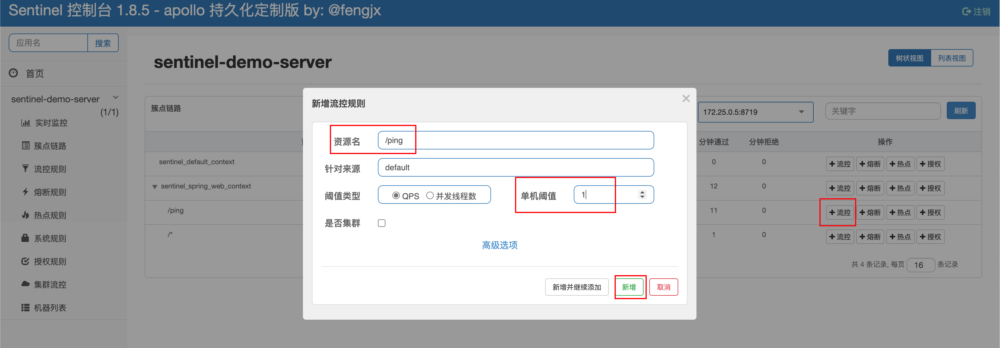

# sentinel-dashboard 使用 demo

spring-boot(cloud) 整合 sentinel demo，包括官方 sentinel-dashboard 版本用法和 sentinel-dashboard-apollo 版本持久化用法。

持久化定制版：<http://blog.fengjx.com/sentinel-dashboard-apollo/>

## 官方版本 demo

```bash
# 详细可以查看脚本内容
./script.sh start_dashboard
```

> 脚本会自动下载官方 sentinel-dashboard jar 包并启动

## apollo 持久化定制版本 demo

为方便演示，这里使用了 docker-compose 来部署，请先安装 docker

需要部署的服务有
- mysql
- apollo
- sentinel-dashboard-apollo
- demo-server

为了方便快速演示，这里写好了`docker-compose.yml`和一键启动脚本，执行下面命令就可以把所有服务跑起来。

```bash
./script.sh start_dashboard_apollo
# apollo 后台：http://localhost:7070, 登录账号：apollo / admin
```

> 初始化数据在`sql`目录，apollo 初始数据已经设置了开放平台 token，如果是自己部署的 apollo 需要自己设置，参考：<https://www.apolloconfig.com/#/zh/usage/apollo-open-api-platform>

> 如果是 mac m1，需求修改 `docker-compose.yml`，`image: mysql:5.7.39`修改为`image: arm64v8/mysql:oracle`

## 限流测试

1. 访问<http://localhost:6080>(登录账号：sentinel / sentinel)
2. 配置限流规则（方便测试，可以吧qps设置小一点）
   
3. 使用测试脚本测试（可以修改脚本，调整并发）
    ```bash
    $ bash test.sh
    1 ok
    2 err 429
    3 err 429
    4 err 429
    5 ok
    6 err 429
    7 err 429
    8 err 429
    9 ok
    10 err 429
    success 3, err: 7
    ```

## 作者


如果有疑问可以联系我的个人微信

